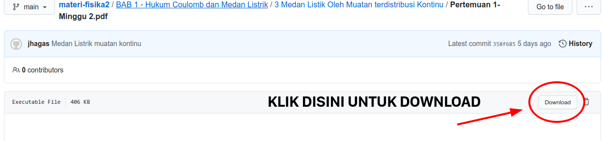

# MATERI FISIKA DASAR 2

Materi dan soal disini adalah catatan maintainer pada kuliah Fisika Dasar 2, Institut Teknologi Sepuluh Nopember.
Ucapan terima kasih disampaikan kepada **Tim Dosen Fisika** di ITS.

> **PENTING:**
Jika ada kesalahan penulisan,
tambahan ataupun saran yang ingin disampaikan,
silahkan mengisi form [disini](https://github.com/jhagas/materi-fisika2/issues/new/choose).
Untuk selengkapnya, silahkan lihat halaman kontribusi [berikut ini](https://jhagas.github.io/materi-fisika2/kontribusi)

## Panduan Singkat

Saat membuka tautan dibawah, anda akan diarahkan menuju halaman preview PDF dari Github,
jika terjadi kesalahan maupun eror, maka anda bisa memuat ulang halaman.

Anda juga bisa mendownload PDF tersebut seperti pada gambar dibawah ini.

Kode sumber dalam bentuk bahasa formatting LaTeX bisa dilihat [disini](https://github.com/jhagas/materi-fisika2).

## List Materi

- **BAB 1**
    - [Hukum Coulomb (Gaya Listrik)](https://github.com/jhagas/materi-fisika2/blob/main/BAB%201%20-%20Hukum%20Coulomb%20dan%20Medan%20Listrik/1%20Hukum%20Coulomb-Gaya%20Listrik/hukum_coulomb.pdf)
    - [Vektor Satuan dan Medan Listrik](https://github.com/jhagas/materi-fisika2/blob/main/BAB%201%20-%20Hukum%20Coulomb%20dan%20Medan%20Listrik/2%20Vektor%20Gaya%20Listrik-Medan%20Listrik/vektor-medan_listrik.pdf)
    - [Medan Listrik Oleh Muatan Yang Terdistribusi Kontinu](https://github.com/jhagas/materi-fisika2/blob/main/BAB%201%20-%20Hukum%20Coulomb%20dan%20Medan%20Listrik/3%20Medan%20Listik%20Oleh%20Muatan%20terdistribusi%20Kontinu/medan_listrik_kontinu.pdf)
    - [Hukum Gauss](https://github.com/jhagas/materi-fisika2/raw/main/BAB%201%20-%20Hukum%20Coulomb%20dan%20Medan%20Listrik/5%20Hukum%20Gauss/hukum_gauss.pdf)
- **BAB 2**
    - [Potensial Listrik](https://github.com/jhagas/materi-fisika2/raw/main/BAB%202%20-%20Potensial%20Listrik/1%20Potensial%20Listrik/potensial_listrik.pdf)
    - [Kapasitor](https://github.com/jhagas/materi-fisika2/raw/main/BAB%202%20-%20Potensial%20Listrik/2%20Kapasitor/kapasitor.pdf)
- **BAB 3**
    - [Arus Listrik Searah](https://github.com/jhagas/materi-fisika2/raw/main/BAB%203%20-%20Arus%20Listrik/1%20Arus%20Listrik%20Searah/arus_dc.pdf)
    - [Hukum Kirchhoff](https://github.com/jhagas/materi-fisika2/raw/main/BAB%203%20-%20Arus%20Listrik/2%20Hukum%20Kirchhoff/hk_kirchhoff.pdf)
- **BAB 4**
    - [Medan Magnet Gaya Magnet](https://github.com/jhagas/materi-fisika2/raw/main/BAB%204%20-%20Medan%20Magnet/1%20Medan%20Magnet%20dan%20Gaya%20Magnet/medan-magnet.pdf)
    - [Hitungan Medan Magnet](https://github.com/jhagas/materi-fisika2/raw/main/BAB%204%20-%20Medan%20Magnet/2%20Perhitungan%20Medan%20Magnet/medan-magnet-kabel.pdf)
- **BAB 5**
    - [Hukum Faraday GGL Induksi](https://github.com/jhagas/materi-fisika2/raw/main/BAB%205%20-%20GGL%20Induksi/1%20Hukum%20Faraday/hukum_faraday_magnet.pdf)
    - [Induktansi](https://github.com/jhagas/materi-fisika2/raw/main/BAB%205%20-%20GGL%20Induksi/2%20Induktor/induktor.pdf)
    
---

- ***EKSTRA (FISIKA III)***
    - [Termometri dan Kalorimetri](https://github.com/jhagas/materi-fisika2/blob/main/EXTRA/Termometri%20dan%20Kalorimetri/termometri-kalorimetri.pdf)

## List Soal-Soal

- [Asistensi 1 (Gaya dan Medan Listrik)](https://github.com/jhagas/materi-fisika2/blob/main/BAB%201%20-%20Hukum%20Coulomb%20dan%20Medan%20Listrik/4%20Asistensi%20Gaya%20dan%20Medan%20Listrik/soal_gaya_medan_listrik.pdf)

